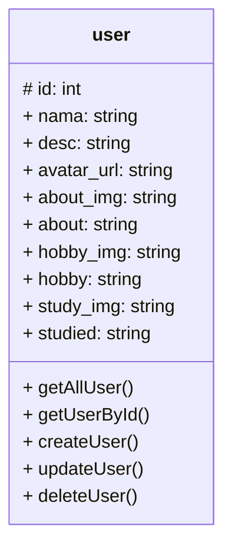

## API POINTS

Berikut adalah API POINTS yang diguakan untuk membangun design dari website portfolio saya

## USER

> getAllUser()

getAllUser adalah fungsi ketika ingin mengambil semua data user dari server

```
GET: /user

response:
[
    {
        "id"                    : "",
        "nama"                  : "",
        "desc"                  : "",
        "avatar_url"            : "",
        "about_img"             : "",
        "about"                 : "",
        "hobby_img"             : "",
        "hobby"                 : "",
        "study_img"             : "",
        "studied"               : ""    
    }
    ....
]
        
    
```
> getUserById

getUserById merupakan fungsi `get` atau mengambil data dari server berdasarkan `id` user tersebut

```
GET: /user/[id]

response:
{
    "id"                    : "",
    "nama"                  : "",
    "desc"                  : "",
    "avatar_url"            : "",
    "about_img"             : "",
    "about"                 : "",
    "hobby_img"             : "",
    "hobby"                 : "",
    "study_img"             : "",
    "studied"               : ""    
}
```

> createUser()

createUSer merupakan fungsi untuk menambahkan data user ke dalam server api

```
POST: /user

headers:
{
    Content-type: 'application/json',
    Authorization: 'Bearer [access_token]'
}

body:
{
    "nama"                  : "",
    "desc"                  : "",
    "avatar_url"            : "",
    "about_img"             : "",
    "about"                 : "",
    "hobby_img"             : "",
    "hobby"                 : "",
    "study_img"             : "",
    "studied"               : ""    
}

response:
true    // if success
false   // if failure
```

> updateUser()

updateUser merupakan fungsi untuk merubah data user

```
PUT: /article

headers:
{
    Content-type: 'application/json',
    Authorization: 'Bearer [access_token]'
}

body:
{
    "id"                    : "",
    "nama"                  : "",
    "desc"                  : "",
    "avatar_url"            : "",
    "about_img"             : "",
    "about"                 : "",
    "hobby_img"             : "",
    "hobby"                 : "",
    "study_img"             : "",
    "studied"               : ""    
}

response:
true    // if success
false   // if failure
```

> deleteUser

deleteUser merupakan fungsi untuk menghapus data user dari server

```
DELETE: /user/[id]

headers:
{
    Content-type: 'application/json',
    Authorization: 'Bearer [access_token]'
}

response:
true    // if success
false   // if failure
```

## Design Database

Kemudian untuk desing database yang saya gunakan adalah berikut:


